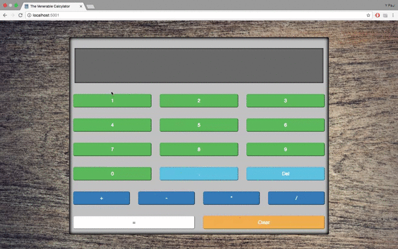

# Server-Side Calculator

Y Paul Sussman: March 17th, 2017; Version 1.0

## Application Overview

This was my first from-scratch software with logic on the server. It does what it says on the label: it's a browser-based calculator. The delay when "computing" is one of the reach goals from the project specs (this was the Weekend Challenge for our second week of in-class instruction at Prime Digital Academy.)

## Getting Started

Fork, clone, or download the project, then run `npm install`.

You'll also need to download [the most-recent version of Bootstrap 3](http://getbootstrap.com/getting-started/#download), then copy the unzipped `bootstrap-3.3.7-dist` folder into `server/public/vendors`.

## Built With

* HTML 5, CSS 3, Bootstrap, and jQuery; and
* Node.js, and Express.js.

## Learning Value

Writing this section some three months later, it's difficult to recall what the major complications building this were, if any. (_Apparently commenting code was a serious challenge for the Y Paul of early 2017..._) I had just become familiar with using the `data-` attribute to store information on the DOM, and `index.html` reveals my excitement.

Module use in node.js was still clearly a heavy concern for me at the time (_witness the 1:1 comment-to-code ratio in_ `app.js`), but honestly? In retrospect, the most pleasant server-side surprise is seeing March-Y-Paul's use of a `switch` statement. June-Y-Paul would have expected him to have been confined to endless `else if` chains: nice work, previous me.

## Demo

  

